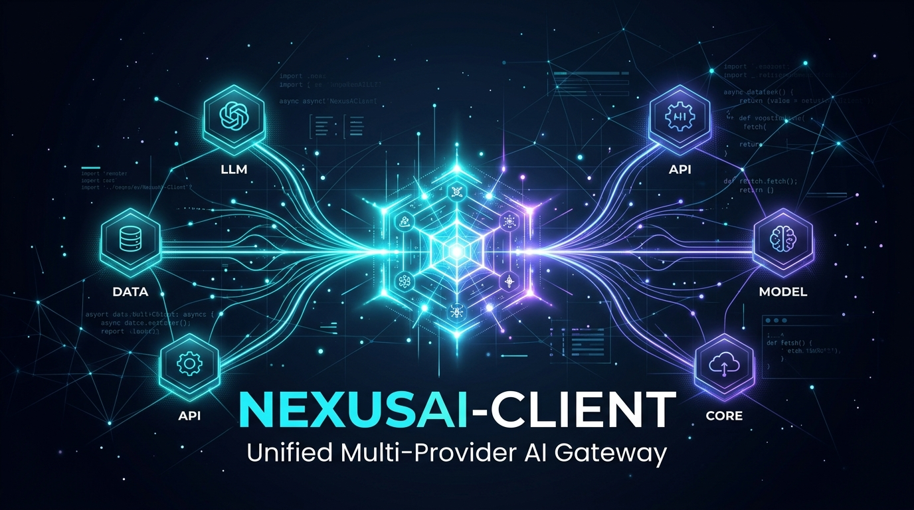

<p align="center">
  
</p>

# NexusAI-Client ⚡

<p align="center">
  <strong>Passerelle IA asynchrone unifiée, ultra-légère et typée pour Python 3.14.</strong><br>
  <em>Unifiez DeepSeek, Google Gemini (Free & Pro), Mistral, Nvidia NIM et OpenRouter sous une interface unique sans SDKs lourds.</em>
</p>

<p align="center">
  <a href="https://www.python.org/downloads/"></a>
  <a href="https://github.com/astral-sh/uv"></a>
  <a href="https://www.python-httpx.org/"></a>
  <a href="https://peps.python.org/pep-0561/"></a>
  <a href="https://github.com/laurentvv/NexusAI-Client/actions"></a>
  <a href="https://opensource.org/licenses/MIT"></a>
</p>

---

## 💡 Pourquoi NexusAI-Client ?

Intégrer plusieurs fournisseurs d'IA dans une application moderne impose généralement d'installer **5 ou 6 SDKs propriétaires distincts** (`google-genai`, `openai`, `mistralai`, etc.). Cela engendre des dizaines de dépendances transitives, des conflits de versions, une empreinte mémoire lourde et du code hétérogène difficile à maintenir.

**NexusAI-Client** résout ce problème à la racine :
- 🪶 **Zéro Dépendance Lourde** : Uniquement propulsé par `httpx` et `python-dotenv`.
- ⚡ **Asynchronisme & Streaming SSE Natif** : Streaming token par token en temps réel via `stream_text()` et `stream_chat()`.
- 🔄 **Smart Fallback Gateway** : Bascule automatique en cas de quota dépassé (HTTP 429) ou de panne (`AIGateway.with_fallback(...)`).
- 🎯 **Sorties JSON Structurées** : Mode `json_mode=True` natif garanti par tous les fournisseurs.
- 💰 **Découverte du Budget & des Quotas en Direct** : Interroge en temps réel les soldes restants (USD, crédits NGC) et les limites (RPM, TPM, RPD).
- 🔍 **Catalogue de 640+ Modèles en Direct** : Découverte automatique des modèles gratuits (`:free`, tiers gratuits) et tarification au million de tokens.

---

## 🏛️ Architecture

```
                             ┌──► 🟣 DeepSeek (V3 / R1 Reasoner - Solde USD en direct)
                             ├──► 🟡 Google Gemini Free (Google AI Studio - 1M tokens de contexte)
                             ├──► 🔵 Google Gemini Pro (Tier Payant GCP)
     [Votre Application] ──► AIGateway ─┼──► 🟠 Mistral AI (Codestral / Small / Large)
                             ├──► 🟢 Nvidia NIM (1 000 crédits offerts / Llama 3.3 70B)
                             └──► ⚪ OpenRouter (Routeur auto openrouter/free & 400+ modèles)
```

---

## 🎯 Matrice des Fournisseurs Supportés

| Fournisseur | Identifiant (`provider`) | Tier | Protocole | Modèle par défaut | Détection Budget & Quotas |
| :--- | :--- | :--- | :--- | :--- | :--- |
| **DeepSeek** | `"deepseek"` | Payant | OpenAI Chat API | `deepseek-chat` | Solde USD en temps réel (`GET /user/balance`) |
| **Gemini Free** | `"gemini_free"` | Gratuit (AI Studio) | Gemini REST | `gemini-2.5-flash` | Quotas : 15 RPM \| 1M TPM \| 1 500 RPD |
| **Gemini Pro** | `"gemini_pro"` | Payant | Gemini REST | `gemini-2.5-pro` | Facturation Google Cloud Pay-as-you-go |
| **Mistral AI** | `"mistral"` | Gratuit / Plateforme | OpenAI Chat API | `mistral-small-latest` | Modèles gratuits (`codestral-latest`, etc.) |
| **Nvidia NIM** | `"nvidia_free"` | Gratuit (NGC) | OpenAI Chat API | `meta/llama-3.1-8b-instruct` | 1 000 crédits d'inférence gratuits NGC |
| **OpenRouter** | `"openrouter"` | Gratuit & Payant | OpenAI Chat API | `openrouter/free` | 19 modèles gratuits en direct + 390 payants |

---

## 🚀 Démarrage Rapide (1 Minute)

### 1. Installation

```bash
# Avec uv (Recommandé)
uv add git+https://github.com/laurentvv/NexusAI-Client.git

# En mode local / éditable
uv add --editable /chemin/vers/NexusAI-Client
```

### 2. Configuration des Clés (`.env`)

Créez un fichier `.env` à la racine de votre projet :

```env
# Fournisseurs Gratuits
GEMINI_FREE_API_KEY=votre_cle_google_ai_studio
MISTRAL_API_KEY=votre_cle_mistral_la_plateforme
NVIDIA_API_KEY=nvapi-votre_cle_nvidia_nim
OPENROUTER_API_KEY=sk-or-v1-votre_cle_openrouter

# Fournisseurs Payants (Optionnels)
DEEPSEEK_API_KEY=sk-votre_cle_deepseek
GEMINI_PRO_API_KEY=votre_cle_gemini_pro
```

### 3. Exemples d'Utilisation

#### A. Génération Simple
```python
import asyncio
from nexusai_client import AIGateway

async def main():
    async with AIGateway("gemini_free") as client:
        response = await client.generate_text("Explique la théorie de la relativité en 2 phrases.")
        print(response.text)

if __name__ == "__main__":
    asyncio.run(main())
```

#### B. Streaming en Temps Réel (Token par Token)
```python
import asyncio
from nexusai_client import AIGateway

async def main():
    async with AIGateway("openrouter") as client:
        async for chunk in client.stream_text("Raconte une fable courte sur les robots."):
            print(chunk, end="", flush=True)

if __name__ == "__main__":
    asyncio.run(main())
```

#### C. Smart Fallback Gateway (Tolérance aux Pannes)
```python
import asyncio
from nexusai_client import AIGateway

async def main():
    # Bascule automatiquement sur le suivant si un provider est saturé (429) ou indisponible
    async with AIGateway.with_fallback(["gemini_free", "nvidia_free", "openrouter", "deepseek"]) as client:
        res = await client.generate_text("Synthétise les avantages de Python 3.14.")
        print(f"[{res.provider}] {res.text}")

if __name__ == "__main__":
    asyncio.run(main())
```

#### D. Sortie JSON Structurée Garantie
```python
import asyncio, json
from nexusai_client import AIGateway

async def main():
    async with AIGateway("gemini_free") as client:
        res = await client.generate_text(
            prompt="Extrais les informations de profil : Alice, 28 ans, développeuse.",
            json_mode=True,
        )
        data = json.loads(res.text)
        print("Profil JSON :", data)

if __name__ == "__main__":
    asyncio.run(main())
```

---

## 🛠️ Outils CLI Inclus

```bash
# 1. Tester et benchmarker tous vos accès et budgets en direct
uv run python verify_access.py

# 2. Explorer le catalogue mondial de 640+ modèles
uv run python list_all_models.py --free
uv run python list_all_models.py --search llama
uv run python list_all_models.py --export catalogue_ia.json

# 3. Lancer la suite de tests unitaires automatisés
uv run pytest -v
```

---

## 🛡️ Gestion Typée des Exceptions

```python
from nexusai_client import (
    AIGateway,
    NexusAIError,
    MissingAPIKeyError,    # Clé API absente dans le .env
    AuthenticationError,   # Clé rejetée (HTTP 401/403)
    RateLimitError,        # Quota dépassé (HTTP 429)
    APITimeoutError,       # Délai d'attente réseau expiré
    APIConnectionError,    # Serveur injoignable
    ProviderNotFoundError, # Fournisseur non reconnu
)
```

---

## 📄 Licence

Ce projet est distribué sous licence **MIT**.
